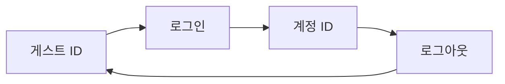

# JavaScript SDK 통합 가이드

## 📋 기본 정보

| 항목 | 내용 |
|------|------|
| **최신 버전** | v2.1.1 |
| **업데이트 날짜** | 2025-02-24 |
| **SDK 용량** | 약 35KB |
| **지원 환경** | 브라우저 (IE 9 이상) |
| **적용 버전** | v2.0.0 이상 |

⚠️ **주의사항**: 이전 버전 사용자는 별도 가이드 참조 필요

---

## 🚀 1. SDK 통합 방법

### 1.1 자동 통합 (NPM)

```bash
npm install thinkingdata-browser --save
```

```javascript
import thinkingdata from "thinkingdata-browser";

var config = {
    appId: "APP_ID",
    serverUrl: "https://YOUR_SERVER_URL",
    batch: true, // 로컬 캐시 후 일괄 전송
    autoTrack: {
        pageShow: true, // 페이지 표시 이벤트 (ta_page_show)
        pageHide: true, // 페이지 숨김 이벤트 (ta_page_hide)
    }
};

thinkingdata.init(config);
```

### 1.2 수동 통합

#### 파일 선택
- **비동기 로딩**: `thinkingdata.min.js`
- **동기 로딩**: `thinkingdata.umd.min.js`

#### 필수 구성 파라미터
| 파라미터 | 설명 | 확인 방법 |
|----------|------|-----------|
| `appId` | 프로젝트 APP_ID | TE 프로젝트 관리 페이지 |
| `serverUrl` | 데이터 전송 URL | SaaS: 프로젝트 설정 → 구성<br>온프레미스: 직접 설정 |

#### 비동기 로딩 예시

```html
<!--Thinking Analytics SDK BEGIN-->
<script>
    !function (e) { /* SDK 로딩 코드 */ }(
    {
        appId: 'APP_ID',
        name: 'ta', // 전역 변수명
        sdkUrl: './thinkingdata.min.js',
        serverUrl: 'https://YOUR_SERVER_URL',
        batch: true,
        autoTrack: {
           pageShow: true,
           pageHide: true,
        },
        loaded: function(ta) {
           // 초기화 완료 후 실행되는 콜백
        }
    });
</script>
<!--Thinking Analytics SDK END-->
```

---

## 🔧 2. 주요 기능

### 2.1 유저 식별 시스템



- **기본**: 랜덤 게스트 ID 생성 및 로컬 저장
- **로그인 후**: 계정 ID가 식별 ID로 사용

### 2.2 계정 ID 설정

```javascript
// 로그인 시 계정 ID 설정
ta.login("TA");
```

⚠️ **참고**: 로그인 이벤트는 별도로 전송되지 않음

### 2.3 공통 이벤트 속성 설정

모든 이벤트에 자동으로 포함되는 속성을 설정합니다.

```javascript
var superProperties = {
    "channel": "ta",           // String
    "age": 1,                  // Number
    "isSuccess": true,         // Boolean
    "birthday": new Date(),    // Date
    "object": {key: "value"},  // Object
    "object_arr": [{key: "value"}], // Object Array
    "arr": ["value"]           // Array
};

ta.setSuperProperties(superProperties);
```

#### 속성 규칙
| 구분 | 규칙 |
|------|------|
| **Key (속성명)** | • 영문자로 시작<br>• 숫자, 영문자, 밑줄(_) 사용 가능<br>• 최대 50자<br>• 대소문자 구분 없음 |
| **Value (속성값)** | String, Number, Boolean, Date, Object, Object Array, Array 지원 |

### 2.4 이벤트 전송

```javascript
ta.track(
    "product_buy",              // 이벤트 이름
    {product_name: "상품명"}     // 이벤트 속성
);
```

#### 이벤트 이름 규칙
- 영문자로 시작
- 숫자, 영문자, 밑줄(_) 사용 가능
- 최대 50자
- 대소문자 구분 없음

### 2.5 유저 속성 설정

```javascript
// 유저 속성 설정 (덮어쓰기/추가)
ta.userSet({ username: "TA" });
```

---

## 💻 3. 완전한 구현 예시

```javascript
import thinkingdata from "thinkingdata-browser";

// 1. SDK 초기화
var config = {
    appId: "APP_ID",
    serverUrl: "https://YOUR_SERVER_URL/sync_js",
    batch: true,
    autoTrack: {
        pageShow: true,
        pageHide: true,
    }
};

window.ta = thinkingdata;
ta.init(config);

// 2. 계정 ID 설정 (로그인 시)
ta.login("TA");

// 3. 공통 이벤트 속성 설정
var superProperties = {
    "channel": "ta",
    "age": 1,
    "isSuccess": true,
    "birthday": new Date(),
    "object": {key: "value"},
    "object_arr": [{key: "value"}],
    "arr": ["value"]
};
ta.setSuperProperties(superProperties);

// 4. 이벤트 전송
ta.track("product_buy", {
    product_name: "상품 이름"
});

// 5. 유저 속성 설정
ta.userSet({username: "TA"});
```

---

## 📌 버전 호환성
| 기능 | 최소 요구 버전 |
|------|----------------|
| Array 타입 | SDK 1.6.0+ & TE 플랫폼 2.5+ |
| Object 타입 | TE 플랫폼 3.5+ |

---

## 🔗 추가 리소스

- **이전 버전**: JS 통합 가이드(V1), SDK 다운로드(V1)
- **데이터 전송 준비**: 별도 문서 참조
- **소스 코드 및 SDK**: 다운로드 링크 제공
