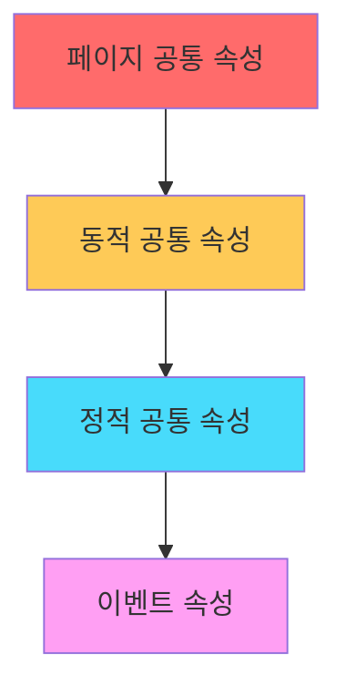

# JavaScript SDK 고급 기능 가이드

## 🔐 1. 유저 식별 설정

### 1.1 게스트 ID 관리

기본적으로 SDK는 랜덤 UUID를 게스트 ID로 생성하여 사용합니다.

```javascript
// 게스트 ID 직접 설정 (일반적으로 불필요)
ta.setDistinctId("Thinker");

// 현재 게스트 ID 확인
var distinctId = ta.getDistinctId();
```

⚠️ **주의**: 게스트 ID는 앱 재설치나 장치 변경 시 변경됩니다.

### 1.2 계정 ID 관리

```javascript
// 로그인 시 계정 ID 설정
ta.login("TA");

// 로그아웃 시 계정 ID 삭제
ta.logout();
```

| 메서드 | 기능 | 이벤트 전송 여부 |
|--------|------|------------------|
| `login()` | 계정 ID 설정 | ❌ |
| `logout()` | 계정 ID 삭제 | ❌ |

---

## 📊 2. 이벤트 전송

### 2.1 일반 이벤트

```javascript
ta.track("product_buy", {
    product_name: "상품 이름"
});
```

### 2.2 최초 이벤트

특정 기준으로 단 한 번만 기록되는 이벤트입니다.

```javascript
// 디바이스 기준 최초 이벤트
ta.trackFirst({
    eventName: "device_activation",
    properties: { key: "value" }
});

// 유저 ID 기준 최초 이벤트
ta.trackFirst({
    eventName: "account_activation",
    firstCheckId: "TA",
    properties: { key: "value" }
});
```

⚠️ **주의**: 최초 이벤트는 서버에서 확인되며, 기본 1시간 지연 후 저장됩니다.

### 2.3 갱신 이벤트

기존 이벤트 데이터를 부분적으로 수정합니다.

```javascript
// 초기 데이터: status=3, price=100
ta.trackUpdate({
    eventName: "UPDATABLE_EVENT",
    properties: { status: 3, price: 100 },
    eventId: "test_event_id"
});

// 업데이트: status=5, price는 유지
ta.trackUpdate({
    eventName: "UPDATABLE_EVENT",
    properties: { status: 5 },
    eventId: "test_event_id"
});
```

### 2.4 덮어쓰기 이벤트

기존 데이터를 완전히 대체합니다.

```javascript
// 초기 데이터
ta.trackOverwrite({
    eventName: "OVERWRITE_EVENT",
    properties: { status: 3, price: 100 },
    eventId: "test_event_id"
});

// 완전 덮어쓰기 (price 정보 삭제됨)
ta.trackOverwrite({
    eventName: "OVERWRITE_EVENT",
    properties: { status: 5 },
    eventId: "test_event_id"
});
```

---

## 🎯 2.5 공통 이벤트 속성

### 속성 우선순위



| 속성 타입 | 적용 범위 | 우선순위 | 저장 위치 | 특징 |
|-----------|-----------|----------|-----------|------|
| **페이지 공통** | 현재 페이지 | 🔴 최고 | 메모리 | 정적 값만 |
| **동적 공통** | 현재 페이지 | 🟡 중간 | 메모리 | 동적 값 가능 |
| **정적 공통** | 전역 | 🔵 최저 | localStorage/Cookie | 정적 값만 |

### 2.5.1 정적 공통 속성

```javascript
// 설정
ta.setSuperProperties({
    channel: "채널 이름",
    user_name: "유저 이름"
});

// 조회
var superProperties = ta.getSuperProperties();

// 특정 속성 삭제
ta.unsetSuperProperty("channel");

// 전체 삭제
ta.clearSuperProperties();
```

### 2.5.2 페이지 공통 속성

```javascript
// 설정
ta.setPageProperty({ page_id: "page10001" });

// 조회
var pageProperty = ta.getPageProperty();
```

### 2.5.3 동적 공통 속성

```javascript
ta.setDynamicSuperProperties(function() {
    var d = new Date();
    d.setHours(10);
    return { date: d };
});
```

---
## ⏱️ 2.6 이벤트 지속 시간 기록

```javascript
// 타이머 시작
ta.timeEvent("stay_shop");

// 작업 수행...

// 이벤트 전송 시 자동으로 #duration 속성 추가 (단위: 초)
ta.track("stay_shop", { product_name: "상품명" });
```

---

## 📦 2.7 배치 전송

SDK v1.6.1+ 지원

```javascript
var config = {
    appId: 'APP_ID',
    serverUrl: 'https://YOUR_SERVER_URL',
    batch: true // 기본 설정
    // 또는 상세 설정
    batch: {
        size: 6,        // 데이터 개수 (1-30)
        interval: 6000, // 전송 간격 (ms)
        maxLimit: 500   // 최대 저장 개수
    }
};
```

### 배치 전송 제한사항

| 제한사항 | 설명 |
|----------|------|
| **콜백 함수** | track의 callback과 동시 사용 불가 |
| **전송 방식** | ajax 방식만 지원 |
| **저장 한계** | localStorage 200개 초과 시 비활성화 |
| **브리지 모드** | app_js_bridge와 동시 사용 불가 |
| **디버그 모드** | debug 모드에서는 즉시 전송 |

---

## 👤 3. 유저 속성

### 3.1 기본 설정 (userSet)

```javascript
ta.userSet({ username: "TA" });  // 덮어쓰기/추가
```

### 3.2 한 번만 설정 (userSetOnce)

```javascript
ta.userSetOnce({ first_payment_time: "2018-01-01 01:23:45.678" });
```

### 3.3 숫자 누적 (userAdd)

```javascript
ta.userAdd({ total_revenue: 30 });   // 초기값
ta.userAdd({ total_revenue: 648 });  // 678로 증가
ta.userAdd({ total_revenue: -100 }); // 578로 감소
```

### 3.4 속성 삭제 (userUnset)

```javascript
ta.userUnset("userPropertykey"); // 특정 속성 삭제
```

### 3.5 유저 삭제 (userDelete)

```javascript
ta.userDelete(); // 유저 속성 전체 삭제 (이벤트 데이터는 유지)
```

### 3.6 배열 추가

```javascript
// 중복 허용 추가
ta.userAppend({ user_list: ["apple", "ball"] });

// 중복 제거 추가 (v1.6.0+)
ta.userUniqAppend({ user_list: ["apple", "cube"] });
```

---

## 🔒 4. 데이터 전송 암호화

SDK v1.6.0+ 지원

### 4.1 설정

```javascript
var config = {
    appId: "xxx",
    serverUrl: "xxx",
    secretKey: {
        publicKey: '공개키',  // TE 관리 콘솔에서 확인
        version: 1           // 공개키 버전
    }
};
```

### 4.2 필수 라이브러리

```html
<script src="https://cdn.bootcdn.net/ajax/libs/crypto-js/4.1.1/crypto-js.js"></script>
<script src="https://cdn.bootcss.com/jsencrypt/3.2.1/jsencrypt.js"></script>
```

---

## 🌐 5. 다중 도메인 연동

SDK v1.6.1+ 지원

```javascript
ta.quick('siteLinker', {
    linker: [
        { part_url: 'thinkingdata.cn', after_hash: true },
        { part_url: 'example.com', after_hash: true }
    ]
});
```

### URL 파라미터 추가 규칙

| 원본 URL | after_hash | 결과 |
|----------|------------|------|
| `https://example.com` | `false` | `https://example.com?_tasdk=distinctID` |
| `https://example.com` | `true` | `https://example.com#?_tasdk=distinctID` |
| `https://example.com#index` | `false` | `https://example.com?_tasdk=distinctID#index` |
| `https://example.com#index` | `true` | `https://example.com#index?_tasdk=distinctID` |

---

## 🛠️ 6. 기타 기능

### 6.1 디바이스 ID 조회

```javascript
var deviceId = ta.getDeviceId();
```

### 6.2 기본 시간대 설정

```javascript
var config = {
    appId: "xxx",
    serverUrl: "xxx",
    zoneOffset: 8 // UTC+8 시간대
};
```

⚠️ **주의**: 시간대 설정 시 로컬 시간대 정보가 손실되므로, 필요 시 이벤트 속성으로 별도 추가해야 합니다.

---

## 📋 요약 체크리스트

- ✅ 유저 식별: 게스트 ID → 계정 ID → 로그아웃
- ✅ 이벤트 타입: 일반/최초/갱신/덮어쓰기
- ✅ 공통 속성: 정적/페이지/동적 (우선순위 고려)
- ✅ 배치 전송: 성능 최적화 (제한사항 확인)
- ✅ 유저 속성: 7가지 API 활용
- ✅ 고급 기능: 암호화, 다중 도메인, 시간대 설정
