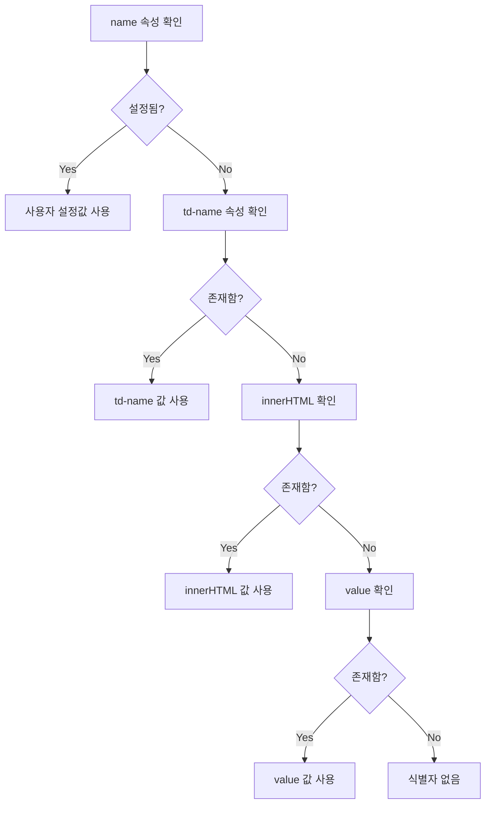

# JavaScript SDK 자동 이벤트 수집 가이드

## 🖱️ 1. HTML 요소 클릭 이벤트 모니터링

### 1.1 기본 사용법

```javascript
ta.trackLink(
    {
        tag: ["a", "button"],           // HTML 태그
        class: ["class1", "class2"],    // CSS 클래스명
        id: ["id1", "id2"]             // 요소 ID
    },
    "click",                           // 이벤트명
    {
        production: "제품명",
        name: "요소 식별자"
    }                                  // 이벤트 속성
);
```

### 1.2 파라미터 상세 설명

| 파라미터 | 타입 | 설명 | 필수 여부 |
|----------|------|------|-----------|
| **1번째** | Object | 모니터링 대상 요소 규칙 | ✅ 필수 |
| **2번째** | String | 이벤트명 | ✅ 필수 |
| **3번째** | Object | 이벤트 속성 | ⚠️ 선택 (빈 객체 `{}` 가능) |

### 1.3 요소 식별자 자동 설정 규칙

`name` 속성이 없을 경우, 다음 우선순위로 자동 설정됩니다:



### 1.4 실제 사용 예시

```html
<!-- HTML 예시 -->
<button class="btn-primary" id="purchase-btn" td-name="구매버튼">
    상품 구매
</button>

<a href="/product" class="product-link">
    제품 상세보기
</a>
```

```javascript
// 클릭 이벤트 모니터링 설정
ta.trackLink(
    {
        tag: ["button", "a"],
        class: ["btn-primary", "product-link"],
        id: ["purchase-btn"]
    },
    "element_click",
    {
        page_type: "product_page"
    }
);
```

### 1.5 주의사항

⚠️ **동적 요소 처리**
- `trackLink` 호출 시점에 존재하는 요소에만 리스너 추가
- 새로 생성된 요소는 별도로 `trackLink` 재호출 필요

```javascript
// 동적 요소 생성 후 모니터링 추가
function addNewButton() {
    // 새 버튼 생성
    const newButton = document.createElement('button');
    newButton.className = 'new-btn';
    document.body.appendChild(newButton);
    
    // 새 요소에 대한 모니터링 추가
    ta.trackLink(
        { class: ["new-btn"] },
        "new_button_click",
        {}
    );
}
```

---

## 📄 2. 페이지 표시 및 숨김 이벤트

### 2.1 기본 설정

SDK v1.6.0+ 지원

```javascript
var config = {
    appId: 'APP_ID',
    serverUrl: 'https://YOUR_SERVER_URL',
    autoTrack: {
        pageShow: true,  // ta_page_show 이벤트 활성화
        pageHide: true   // ta_page_hide 이벤트 활성화
    }
};

ta.init(config);
```

### 2.2 이벤트 상세 정보

| 이벤트명 | 발생 시점 | 특별 속성 | 설명 |
|----------|-----------|-----------|------|
| `ta_page_show` | 페이지 표시 시 | - | 페이지 로드/포커스 시 |
| `ta_page_hide` | 페이지 숨김 시 | `#duration` | 페이지 체류 시간(초) |

### 2.3 싱글 페이지 애플리케이션(SPA) 적용

#### Vue.js 예시

```javascript
// Vue Router 설정
router.afterEach((to, from) => {
    Vue.nextTick(() => {
        window.ta.autoTrackSinglePage();
    });
});
```

#### React 예시

```javascript
// React Router 설정
import { useEffect } from 'react';
import { useLocation } from 'react-router-dom';

function App() {
    const location = useLocation();
    
    useEffect(() => {
        window.ta.autoTrackSinglePage();
    }, [location]);
    
    return <div>...</div>;
}
```

#### Angular 예시

```typescript
// Angular Router 설정
import { Router, NavigationEnd } from '@angular/router';

constructor(private router: Router) {
    this.router.events.subscribe(event => {
        if (event instanceof NavigationEnd) {
            (window as any).ta.autoTrackSinglePage();
        }
    });
}
```

---

## 👁️ 3. 페이지 조회 이벤트

### 3.1 기본 페이지뷰 추적

```javascript
// 즉시 ta_pageview 이벤트 전송
ta.quick("autoTrack");
```

### 3.2 커스텀 속성 포함 (v1.6.0+)

```javascript
ta.quick('autoTrack', {
    name: 'test_name',
    time: new Date(),
    pro: [1, 2, 3, 4],
    page_category: 'product',
    user_level: 'premium'
});
```

### 3.3 SPA에서의 페이지뷰 추적

```javascript
// 라우트 변경 시마다 호출
function trackPageView(pageName, pageUrl) {
    ta.quick('autoTrack', {
        page_name: pageName,
        page_url: pageUrl,
        timestamp: new Date()
    });
}

// Vue Router 예시
router.afterEach((to, from) => {
    trackPageView(to.name, to.path);
});
```

---

## 🔄 4. 자동 이벤트 수집 통합 예시

```javascript
// SDK 초기화 - 자동 이벤트 활성화
var config = {
    appId: 'APP_ID',
    serverUrl: 'https://YOUR_SERVER_URL',
    autoTrack: {
        pageShow: true,
        pageHide: true
    }
};

ta.init(config);

// 페이지 로드 시 초기 설정
document.addEventListener('DOMContentLoaded', function() {
    // 1. 페이지뷰 이벤트 전송
    ta.quick('autoTrack', {
        page_type: 'landing',
        source: 'organic'
    });
    
    // 2. 클릭 이벤트 모니터링 설정
    ta.trackLink(
        {
            tag: ["button", "a"],
            class: ["btn", "link"],
            id: ["cta-button", "nav-link"]
        },
        "element_click",
        {
            page_section: 'main'
        }
    );
});

// SPA 라우트 변경 처리
function handleRouteChange(newRoute) {
    // 페이지 표시/숨김 이벤트 트리거
    ta.autoTrackSinglePage();
    
    // 새 페이지뷰 이벤트
    ta.quick('autoTrack', {
        page_name: newRoute.name,
        page_path: newRoute.path
    });
}
```

---

## 📊 5. 자동 수집 이벤트 요약
| 이벤트 타입 | 이벤트명 | 활성화 방법 | 주요 속성 |
|-------------|----------|-------------|-----------|
| **클릭 추적** | 사용자 정의 | `trackLink()` | `name` (요소 식별자) |
| **페이지 표시** | `ta_page_show` | `autoTrack.pageShow: true` | 기본 페이지 속성 |
| **페이지 숨김** | `ta_page_hide` | `autoTrack.pageHide: true` | `#duration` (체류시간) |
| **페이지뷰** | `ta_pageview` | `ta.quick("autoTrack")` | 커스텀 속성 가능 |

---

## ⚡ 6. 성능 최적화 팁

### 6.1 클릭 이벤트 최적화

```javascript
// ❌ 비효율적: 모든 요소 모니터링
ta.trackLink({ tag: ["*"] }, "click", {});

// ✅ 효율적: 필요한 요소만 선택적 모니터링
ta.trackLink(
    { class: ["important-btn", "cta-link"] },
    "important_click",
    {}
);
```

### 6.2 SPA 성능 고려사항

```javascript
// 라우트 변경 시 불필요한 중복 호출 방지
let lastRoute = '';

function handleRouteChange(currentRoute) {
    if (lastRoute !== currentRoute) {
        ta.autoTrackSinglePage();
        lastRoute = currentRoute;
    }
}
```

---

## 🎯 7. 실전 활용 시나리오

### 7.1 전자상거래 사이트

```javascript
// 상품 페이지 자동 추적
ta.quick('autoTrack', {
    page_type: 'product',
    product_id: getProductId(),
    category: getProductCategory()
});

// 구매 관련 버튼 추적
ta.trackLink(
    {
        class: ["add-to-cart", "buy-now", "wishlist"],
        id: ["checkout-btn"]
    },
    "product_interaction",
    {
        product_name: getProductName(),
        price: getProductPrice()
    }
);
```

### 7.2 콘텐츠 사이트

```javascript
// 아티클 읽기 추적
ta.quick('autoTrack', {
    content_type: 'article',
    article_id: getArticleId(),
    author: getAuthor(),
    word_count: getWordCount()
});

// 소셜 공유 버튼 추적
ta.trackLink(
    { class: ["share-btn"] },
    "content_share",
    {
        share_platform: getSocialPlatform(),
        content_title: getContentTitle()
    }
);
```

이제 자동 이벤트 수집 기능을 통해 사용자 행동을 효율적으로 추적할 수 있습니다! 🚀

